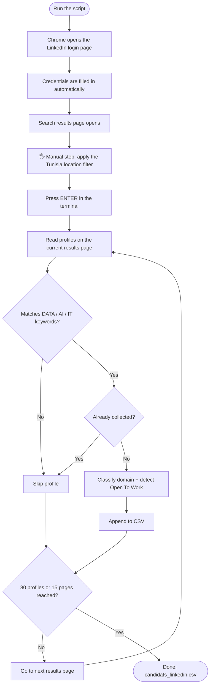

<h1 align="center">LinkedIn Profile Scraper – Tunisia</h1>

<p align="center">
  A Python &amp; Selenium tool that collects up to <b>80 Tunisia-based LinkedIn profiles</b> in <b>IT, Data and AI</b>, classifies them by domain, and exports everything to a clean CSV file.
</p>

<p align="center">
  
  
  
  
  
</p>

---

## Table of Contents

- [Overview](#overview)
- [Features](#features)
- [How It Works](#how-it-works)
- [Tech Stack](#tech-stack)
- [Getting Started](#getting-started)
- [Usage](#usage)
- [Output](#output)
- [Domain Detection](#domain-detection)
- [Open To Work Detection](#open-to-work-detection)
- [Deduplication](#deduplication)
- [Debugging](#debugging)
- [Limitations](#limitations)
- [Legal & Privacy Disclaimer](#legal--privacy-disclaimer)
- [Author](#author)

---

## Overview

This project automates the collection of public profile information from LinkedIn search results. It targets professionals located in **Tunisia** who work in **IT, Data, Artificial Intelligence**, and related technical fields.

Every collected profile is classified by domain, checked for an *Open To Work* indicator, deduplicated, and written to a CSV file ready for further analysis and processing.

## Features

- 🔎 Searches LinkedIn profiles using a predefined keyword
- 🇹🇳 Focuses on profiles located in Tunisia
- 🧠 Automatically classifies each profile as **DATA**, **AI**, **IT**, or a combination of these
- 🟢 Detects whether *Open To Work* is visible in the search result
- 📄 Extracts name, position, location, domain, Open To Work status, profile URL and additional information
- ♻️ Built-in profile deduplication
- 📑 Automatic pagination through the search results (up to 15 pages)
- 💾 Automatic creation and update of the CSV file
- 🐞 Automatic HTML dump for debugging when no results are detected

## How It Works



## Tech Stack

| Tool | Purpose |
|------|---------|
| **Python** | Core language |
| **Selenium** | Browser automation |
| **Google Chrome** | Browser used by Selenium |
| **CSV** | Output format |
| **Pathlib** | File path handling |

## Getting Started

### Prerequisites

- [Python](https://www.python.org/downloads/) installed on your machine
- A compatible version of **Google Chrome**

### Installation

```bash
# 1. Clone the repository
git clone https://github.com/salmaa16/LinkedIn_Scraping.git
cd LinkedIn_Scraping

# 2. Install the dependency
pip install selenium
```

### Configuration

Open the Python file and replace the placeholders with your own LinkedIn credentials:

```python
EMAIL_LINKEDIN = "YOUR_EMAIL_HERE"
MOT_DE_PASSE_LINKEDIN = "YOUR_PASSWORD_HERE"
```

> [!WARNING]
> Never commit your real credentials to GitHub. Keep the placeholders in the version you push, and only add your real values locally.

## Usage

**1. Run the script**

```bash
python scraping_linkedin.py
```

Chrome opens and the script fills in the LinkedIn login form.

**2. Apply the Tunisia filter manually**

Once the search page is open, the terminal asks you to:

1. Open the **Locations** filter
2. Select **Tunisia**
3. Apply the filter
4. Leave the existing search keywords unchanged
5. Return to the terminal and press **ENTER**

> [!NOTE]
> The Tunisia location filter is handled manually on purpose.

**3. Collection starts**

After you press ENTER, the script reads the displayed search results and keeps only profiles matching the predefined DATA, AI or IT keywords.

| Limit | Value |
|-------|-------|
| Maximum profiles collected | **80** |
| Maximum result pages visited | **15** |

## Output

Profiles are saved automatically to **`candidats_linkedin.csv`**.

| Column | Description |
|--------|-------------|
| `Nom` | Profile name |
| `Poste` | Current or displayed position |
| `Localisation` | Profile location |
| `Domaine` | Detected domain: `DATA`, `AI`, `IT` (or a combination) |
| `Open To Work` | Open To Work status, when detected |
| `URL LinkedIn` | LinkedIn profile URL |
| `Informations` | Additional extracted information |

**Illustrative example (fictional data):**

| Nom | Poste | Localisation | Domaine | Open To Work | URL LinkedIn |
|-----|-------|--------------|---------|--------------|--------------|
| Jane Doe | Data Engineer | Tunis, Tunisia | DATA | Détecté | `https://www.linkedin.com/in/...` |
| John Smith | Full Stack Developer | Sfax, Tunisia | IT | Non détecté | `https://www.linkedin.com/in/...` |

## Domain Detection

The script relies on predefined keyword lists to decide whether a profile is relevant and which domain it belongs to.

| Domain | Example keywords |
|--------|------------------|
| **DATA** | Data Analyst, Data Scientist, Data Engineer, Business Intelligence, Business Analyst, Power BI, SQL, Data Warehouse, ETL, Analytics, Data Mining |
| **AI** | Artificial Intelligence, AI Engineer, Machine Learning, Deep Learning, Computer Vision, NLP, Generative AI, LLM, Neural Networks, Robotics |
| **IT** | Software Engineer, Software Developer, Web Developer, DevOps, Cloud, Cybersecurity, System Administrator, Network Engineer, Full Stack, Frontend, Backend, Java, Python, JavaScript, PHP, C++ |

A profile matching several lists receives a combined domain label.

## Open To Work Detection

The script scans the visible text of each search result for *Open To Work* expressions. The column value is either:

- `Détecté`
- `Non détecté`

## Deduplication

To avoid saving the same person twice:

1. If the **LinkedIn profile URL** is available, it is used as the unique key.
2. Otherwise, the script falls back to a combination of **name + position + location + additional information**.

## Debugging

If no profile results are detected, the script saves the current page source to:

```
linkedin_debug_final.html
```

Use this file to inspect the page and identify changes in LinkedIn's structure.

## Limitations

- LinkedIn regularly changes its page structure, so Selenium selectors may need updates over time.
- The script was built around the interface observed during development and may not work unchanged after an interface change.
- The Tunisia location filter must be applied manually.
- Collection is capped at 80 profiles and 15 result pages per run.

## Legal & Privacy Disclaimer

This project is intended for **educational and research purposes only**.

- Automated data collection may conflict with [LinkedIn's User Agreement](https://www.linkedin.com/legal/user-agreement), and using automation on your account can lead to restrictions. Use it at your own risk.
- The generated CSV contains personal data. Do **not** publish it, and do not push `candidats_linkedin.csv` or `linkedin_debug_final.html` to a public repository (add them to your `.gitignore`).
- You are responsible for using this tool in accordance with LinkedIn's terms and policies and with applicable local data-protection laws.

## Author

Developed as a Python / Selenium scraping project for collecting and analyzing LinkedIn profile data related to IT, Data and Artificial Intelligence.

**salma ayachi** · [GitHub](https://github.com/salmaa16) · [LinkedIn](https://www.linkedin.com/in/salma-ayachi-1b5286387/)
